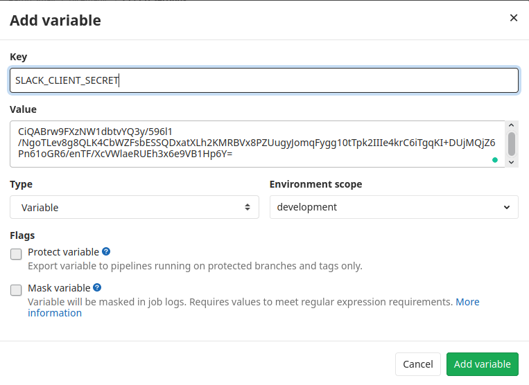

# How-To Create a new cluster

Written for GKE clusters. 

## create the cluster

1) Enable workload identity on cluster and node pools


## create slack secrets

enable KMS API

```bash
gcloud services enable cloudkms.googleapis.com
```

create KMS key
```bash
gcloud kms keyrings create "dice-magic" --location "us-central1"
gcloud kms keys create "slack" \ 
    --location "us-central1" \
    --keyring "dice-magic" \
    --purpose encryption
```

ensure there is a place to put the secrets for the generator
```bash
mkdir -p ./config/development/secrets
```

encrypt secrets from slack
```bash
CLIENT_SECRET=dbf4596580742777700138e4b433c6fd
SIGNING_SECRET=4608932ec5f334fbbbe65f370b530e5a

TMPFILE1=$(mktemp);TMPFILE2=$(mktemp)
printf ${CLIENT_SECRET} > ${TMPFILE1};printf ${SIGNING_SECRET} > ${TMPFILE2}
gcloud kms encrypt \
    --location "us-central1" \
    --keyring "dice-magic" \
    --key "slack" \
    --plaintext-file ${TMPFILE1} \
    --ciphertext-file ./config/development/secrets/slack/slack-client-secret
gcloud kms encrypt \
    --location "us-central1" \
    --keyring "dice-magic" \
    --key "slack" \
    --plaintext-file ${TMPFILE2} \
    --ciphertext-file ./config/development/secrets/slack/slack-signing-secret
rm  ${TMPFILE1} ${TMPFILE2}
```

## Create GSA and Bind KSA to GSA

```bash
PROJECT_ID=dicemagic-dev
gcloud config set project ${PROJECT_ID}
gcloud iam service-accounts create dicemagic-ksa
gcloud iam service-accounts create certbot-ksa 
gcloud iam service-accounts add-iam-policy-binding \
  --role roles/iam.workloadIdentityUser \
  --member "serviceAccount:${PROJECT_ID}.svc.id.goog[default/dicemagic-serviceaccount]" \
  dicemagic-ksa@${PROJECT_ID}.iam.gserviceaccount.com
gcloud iam service-accounts add-iam-policy-binding \
  --role roles/iam.workloadIdentityUser \
  --member "serviceAccount:${PROJECT_ID}.svc.id.goog[default/certbot-ksa]" \
  certbot-ksa@${PROJECT_ID}.iam.gserviceaccount.com

```

## enable datastore

```bash
gcloud services enable datastore.googleapis.com
```
open `https://console.cloud.google.com/datastore/setup?project=dicemagic-dev` in a browser and select `datastore` then pick a sensible location.

grant datastore permissions to GSA
```bash
PROJECT_ID=dicemagic-dev
gcloud projects add-iam-policy-binding ${PROJECT_ID} \
  --role roles/datastore.user \
  --member serviceAccount:dicemagic-ksa@${PROJECT_ID}.iam.gserviceaccount.com
```

## create static IP and update local config file

```bash 
gcloud compute addresses create dicemagic-ip --region us-central1
IP=$(gcloud compute addresses describe dicemagic-ip --region us-central1 | awk '$1=="address:" {print $2}')
sed -i --regexp-extended "s/loadBalancerIP: \".*\"/loadBalancerIP: \"${IP}\"/g" \
    config/development/nginx-loadbalancer.yaml
```

## point DNS at static IP

## run certbot job

grant certbot permissions 

```bash
PROJECT_ID=dicemagic-dev
gcloud projects add-iam-policy-binding ${PROJECT_ID} \
  --role roles/dns.admin \
  --member serviceAccount:certbot-ksa@${PROJECT_ID}.iam.gserviceaccount.com
```
run the job to get certs once
```bash
kubectl create job --from=cronjob/letsencrypt-job certbot
```

## grant dicemagic-serviceaccount permission to decrypt
dicemagic-ksa@dicemagic-dev.iam.gserviceaccount.com
roles/cloudkms.cryptoKeyDecrypter

```bash
PROJECT_ID=dicemagic-dev
gcloud projects add-iam-policy-binding ${PROJECT_ID} \
  --role roles/cloudkms.cryptoKeyDecrypter \
  --member serviceAccount:dicemagic-ksa@${PROJECT_ID}.iam.gserviceaccount.com
PROJECT_ID=dicemagic-dev
gcloud projects add-iam-policy-binding ${PROJECT_ID} \
  --role roles/cloudkms.cryptoKeyEncrypter \
  --member serviceAccount:dicemagic-ksa@${PROJECT_ID}.iam.gserviceaccount.com
```

## base64 encrypted secrets and add to CI config 

SLACK_CLIENT_SECRET
```bash
base64 config/development/secrets/slack/slack-client-secret -w 0 | xclip -sel clip
```
SLACK_SIGNING_SECRET
```bash
base64 config/development/secrets/slack/slack-signing-secret -w 0 | xclip -sel clip
```
SELF_CERT
```bash
base64 config/development/secrets/letsencrypt-certs/tls.crt -w 0 | xclip -sel clip
```
SELF_KEY
```bash
base64 config/development/secrets/letsencrypt-certs/tls.key -w 0 | xclip -sel clip
```

for example:

